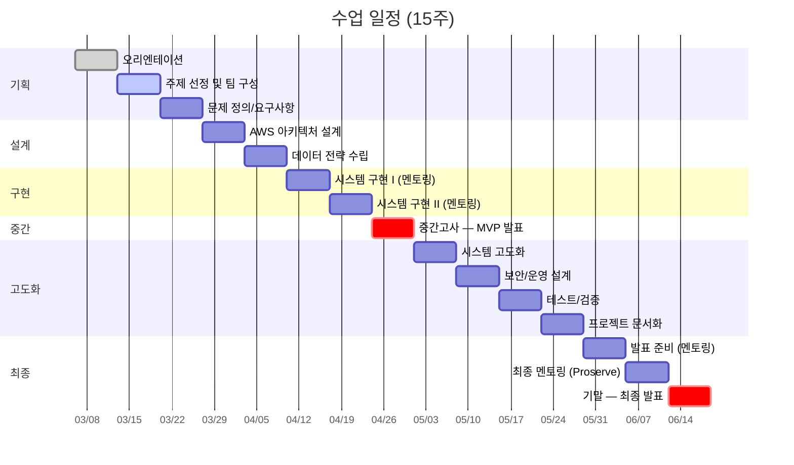
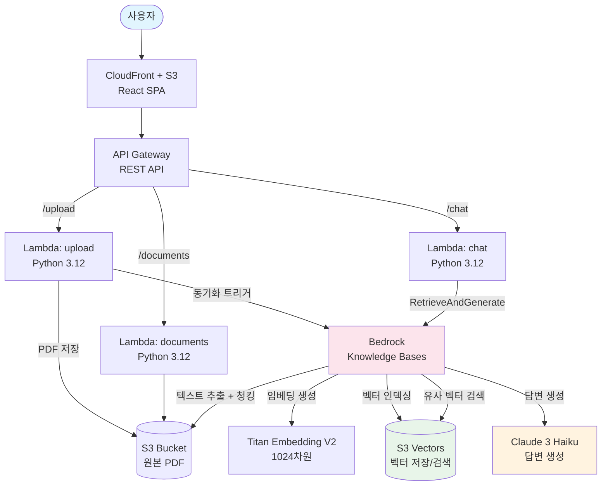
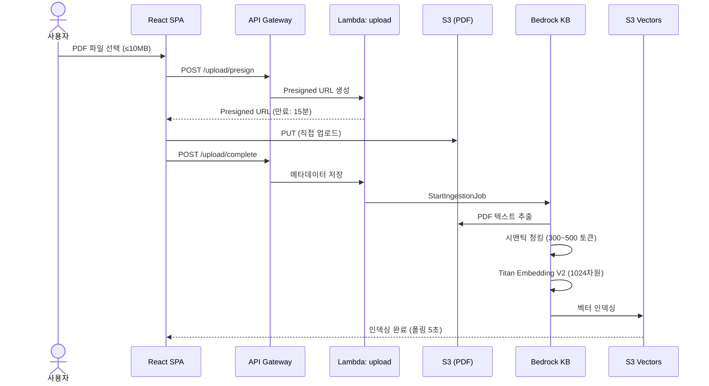
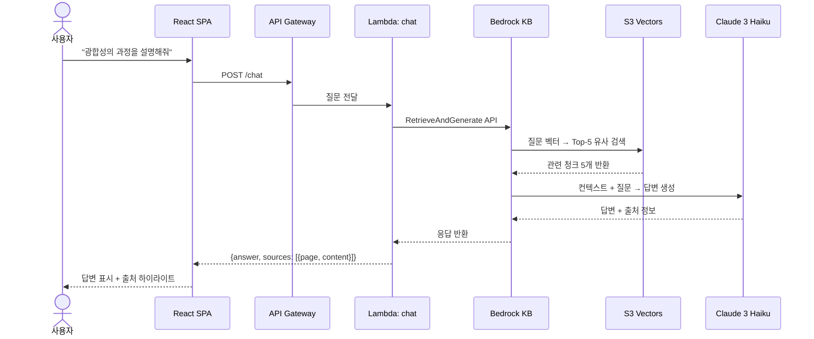
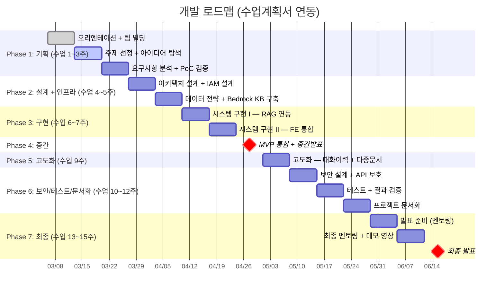
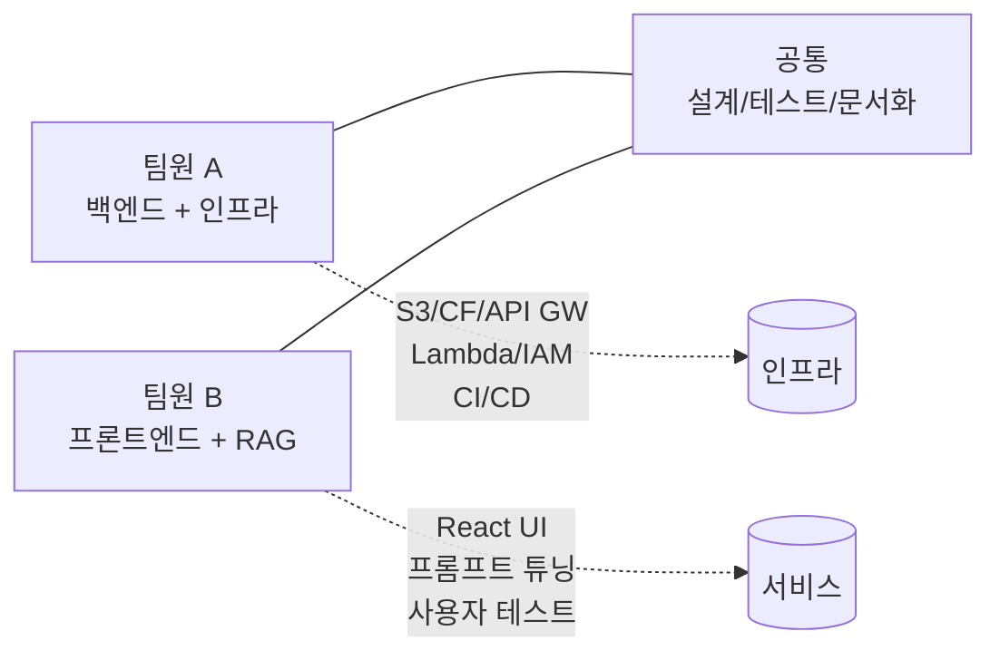

# AWS 캡스톤 프로젝트 기획 보고서

> [!abstract] 한 줄 요약
> 학생이 PDF를 업로드하면 AI가 해당 문서를 기반으로 질문에 답변하는 **RAG 챗봇**을 AWS 완전 서버리스 아키텍처로 구축한다. 15주간 총 비용 **$5~8** (운영 $2~3 + 개발/테스트 $2~5).

---

## 1. Executive Summary

| 항목 | 내용 |
|:-----|:-----|
| **프로젝트명** | AI 학습 도우미 챗봇 (StudyBot) |
| **과목** | AWS실전프로젝트I (1670501-01) |
| **학과** | AWS·양자통신융합전공, 4학년 |
| **담당교수** | 박준석 교수 (jspark@kookmin.ac.kr) |
| **기간** | 2026-03-06 ~ 2026-06-12 (15주) |
| **팀 규모** | 2~3인 |
| **공적가치** | 청소년 교육 접근성 향상 |

### 핵심 가치 매트릭스

| 관점 | 내용 |
|:-----|:-----|
| **Problem** | 청소년/학생이 교과서를 복습할 때 즉각적인 질의응답 도구가 없어 학습 효율이 떨어진다 |
| **Solution** | PDF → RAG 파이프라인(청킹→임베딩→벡터검색) → Bedrock LLM이 근거 기반 답변 생성 |
| **UX Effect** | 문서 업로드 후 즉시 대화형 Q&A 가능. 답변마다 **출처(페이지/문단)** 표시 |
| **Core Value** | AWS 완전관리형 서버리스 아키텍처. 월 운영비 **$1 미만**, 교육 접근성 향상 |

---

## 2. 프로젝트 배경

### 2.1 수업 개요



### 2.2 평가 기준

| 항목 | 비중 | 우리 전략 |
|:-----|:----:|:----------|
| 중간고사 | 20% | 8주차 MVP 데모 (PDF 업로드 → Q&A) |
| 기말고사 | 30% | 최종 발표 + 완성 서비스 데모 |
| 프로젝트 | 30% | 아키텍처 설계 + 구현 완성도 |
| 과제물 | 10% | 기술 문서, 아키텍처 다이어그램 |
| 출석 | 5% | 매주 금 09:00~12:00 출석 |
| 수업참여도 | 5% | 수업 중 질문/토론 참여, 멘토링 적극성 |

### 2.3 주요 제약조건

> [!important] 핵심 제약사항
> - **팀 규모**: 2~3인
> - **AWS 경험**: 기초 수준 (EC2, S3, Lambda 정도)
> - **기간**: 15주 (실 개발 약 10주)
> - **AI 활용**: **전면 허용** (개념이해, 브레인스토밍, 과제, 인프라 구축)
> - **멘토**: AWS Proserve Team 컨설턴트 지원

---

## 3. 아이디어 탐색 과정

### 3.1 검토한 3가지 아이디어

총 3개의 CTO 설계팀을 병렬 가동하여 각 아이디어를 독립적으로 분석했다.

#### A. AI 학습 도우미 챗봇 (RAG)

> 교과서 PDF 업로드 → AI가 문서 기반 질문 답변 + 출처 표시

- 핵심 서비스: Bedrock + S3 Vectors + Knowledge Bases
- 상세 설계: [[2026-03-13-capstone-idea-A-rag-chatbot]]

#### B. 실시간 뉴스 감정 분석 대시보드

> 뉴스 RSS/API 자동 수집 → Comprehend 감정 분석 → 실시간 대시보드

- 핵심 서비스: EventBridge + Comprehend + DynamoDB
- 상세 설계: [[2026-03-13-capstone-idea-B-news-sentiment]]

#### C. 이미지 자동 분류·검색 시스템

> 이미지 업로드 → Rekognition 자동 태깅 → 벡터 유사 검색

- 핵심 서비스: Rekognition + Bedrock Embeddings + OpenSearch Serverless
- 상세 설계: [[2026-03-13-capstone-idea-C-image-search]]

### 3.2 비교 분석표

| 항목 | A. RAG 챗봇 | B. 뉴스 감정분석 | C. 이미지 검색 |
|:-----|:---:|:---:|:---:|
| **15주 총 비용** | **~$5~8** | ~$8~50 | **~$270+** |
| **월 비용** | $1.06 | $2~13 | $173~350 |
| **구현 난이도** | ★★☆ | ★★☆ | ★★★☆ |
| **공적가치 부합** | ✅ 완벽 (청소년 교육) | ⚠️ 간접적 | ⚠️ 간접적 |
| **취업 어필력** | ✅ RAG = 최고 트렌드 | 데이터 엔지니어링 | 멀티모달 AI |
| **AWS 멘토 관심도** | ✅ Bedrock 주력 | 보통 | 보통 |
| **비용 리스크** | ✅ 매우 낮음 | 낮음 | ❌ 높음 (AOSS) |
| **최신 서비스** | ✅ S3 Vectors (2025.12) | EventBridge | — |

### 3.3 의사결정

> [!success] 선정 결과: **아이디어 A — AI 학습 도우미 챗봇**
>
> **선정 사유** (4가지):
> 1. 수업 공적가치("청소년-교육")에 **유일하게 직접 부합**
> 2. 15주 총 비용 $5~8 (개발/테스트 포함) — 학생 크레딧의 5~8%만 사용
> 3. RAG는 2026년 현재 **산업계 최고 수요 기술**
> 4. AWS Bedrock 활용 → **멘토의 적극적 서포트** 기대
>
> **탈락 사유**:
> - B: 기술적으로 무난하나 차별화 약함
> - C: OpenSearch Serverless 월 $173 → **비용 리스크 과대**

---

## 4. 선정 아이디어 상세 설계

### 4.1 시스템 아키텍처



### 4.2 핵심 설계 결정 (ADR)

> [!note] ADR = Architecture Decision Record

| # | 결정 사항 | 선택 | 기각된 대안 | 근거 |
|:-:|:----------|:-----|:-----------|:-----|
| 1 | 벡터 DB | **S3 Vectors** | OpenSearch Serverless ($173~350/월) | 99.9% 비용 절감, 2025.12 GA, Bedrock KB 공식 지원 |
| 2 | RAG 파이프라인 | **Bedrock Knowledge Bases** | LangChain 직접 구현 | 코드량 80% 감소, 관리형 서비스 |
| 3 | LLM | **Claude 3 Haiku** | Claude Sonnet, Titan | 토큰당 비용 최저, 학습 Q&A에 충분 |
| 4 | 임베딩 모델 | **Titan Embeddings V2** | Cohere Embed | AWS 네이티브 통합, $0.00011/1K 토큰 |
| 5 | 프론트엔드 | **React + Vite** | Next.js | 정적 호스팅만 필요, SSR 불필요 |
| 6 | 백엔드 | **Python 3.12 Lambda** | TypeScript Lambda | boto3 기본 포함, Bedrock 레퍼런스 풍부 |
| 7 | IaC | **AWS SAM** | CDK, Terraform | Lambda+API GW 통합 배포, 학습 곡선 낮음 |

### 4.3 데이터 파이프라인

#### 문서 업로드 흐름



#### 질문-답변 흐름



### 4.4 AWS 서비스 전체 구성

| # | 서비스 | 역할 | 과금 모델 |
|:-:|:-------|:-----|:---------|
| 1 | S3 (정적 호스팅) | React 앱 호스팅 | 프리티어 |
| 2 | CloudFront | CDN + HTTPS + 단일 도메인 | 프리티어 |
| 3 | API Gateway | REST API (6개 엔드포인트) | 프리티어 |
| 4 | Lambda ×4 | upload(presign, complete), chat, documents — 6개 엔드포인트 | 프리티어 |
| 5 | S3 (문서 버킷) | 원본 PDF 저장 | 프리티어 |
| 6 | Bedrock Knowledge Bases | RAG 파이프라인 자동화 | 종량제 |
| 7 | S3 Vectors | 벡터 저장/검색 | 종량제 (~$0.04/월) |
| 8 | Bedrock (Titan Embedding V2) | 텍스트 임베딩 생성 | 종량제 (~$0.02/월) |
| 9 | Bedrock (Claude 3 Haiku) | LLM 답변 생성 | 종량제 (~$0.50/월) |
| 10 | IAM | 권한 관리 | 무료 |
| 11 | CloudWatch | 모니터링 + 비용 알림 | 기본 무료 |

### 4.5 API 명세

| Method | Path | 설명 | Lambda |
|:-------|:-----|:-----|:-------|
| `POST` | `/api/upload/presign` | Presigned URL 생성 | upload |
| `POST` | `/api/upload/complete` | 업로드 완료 + KB 동기화 | upload |
| `GET` | `/api/upload/status/{jobId}` | 동기화 상태 조회 | upload |
| `POST` | `/api/chat` | 질문-답변 | chat |
| `GET` | `/api/documents` | 문서 목록 조회 | documents |
| `DELETE` | `/api/documents/{id}` | 문서 삭제 | documents |

### 4.6 프론트엔드 구조

```
src/
├── App.tsx                    # 메인 앱
├── components/
│   ├── ChatWindow.tsx         # 채팅 메시지 목록
│   ├── ChatInput.tsx          # 질문 입력 폼
│   ├── MessageBubble.tsx      # 개별 메시지 (사용자/AI)
│   ├── SourceCard.tsx         # 출처 표시 카드
│   ├── FileUpload.tsx         # PDF 업로드 (드래그앤드롭)
│   ├── DocumentList.tsx       # 업로드된 문서 목록
│   ├── LoadingSpinner.tsx     # 로딩 인디케이터
│   └── IngestionStatus.tsx    # KB 동기화 상태 (폴링)
├── hooks/
│   ├── useChat.ts             # 채팅 API 훅
│   └── useUpload.ts           # 업로드 API 훅
├── lib/
│   └── api.ts                 # fetch wrapper
├── types/
│   └── index.ts               # 타입 정의
└── styles/
    └── globals.css            # Tailwind
```

| 기술 | 선택 | 비고 |
|:-----|:-----|:-----|
| UI 프레임워크 | React 19 | — |
| 빌드 | Vite 6.x | 빠른 HMR |
| CSS | Tailwind CSS 4.x | 유틸리티 퍼스트 |
| HTTP 클라이언트 | fetch (네이티브) | 추가 의존성 없음 |
| 상태관리 | useState/useReducer | 별도 라이브러리 불필요 |
| 마크다운 | react-markdown | AI 답변 렌더링 |

### 4.7 Lambda 함수 구조

```
functions/
├── upload/
│   ├── presign.py             # Presigned URL 생성
│   └── complete.py            # 업로드 완료 + KB 동기화
├── chat/
│   └── handler.py             # RetrieveAndGenerate
├── documents/
│   └── handler.py             # 문서 CRUD
└── shared/layer/
    ├── bedrock_client.py      # Bedrock 클라이언트
    └── response_helper.py     # 응답 포맷터
```

| 함수 | 메모리 | 타임아웃 | 비고 |
|:-----|:------:|:--------:|:-----|
| upload/presign | 128MB | 10초 | 경량 |
| upload/complete | 256MB | 30초 | KB 동기화 |
| chat/handler | 256MB | **25초** | API GW 29초 리밋 고려 |
| documents/handler | 128MB | 10초 | 경량 |

---

## 5. 개발 타임라인

### 5.1 15주 로드맵



### 5.2 주차별 상세 계획

| 주차 | 날짜 | 수업 주제 | 팀 활동 | 산출물 | 멘토링 |
|:----:|:-----|:---------|:--------|:-------|:------:|
| 1 | 03/06 | 오리엔테이션 | 팀 빌딩, AWS 계정 설정, Bedrock Model Access 요청 | 팀 구성표, AWS 계정 | |
| 2 | 03/13 | 주제 선정 + 팀 구성 | 아이디어 탐색 (3안 비교), 주제 선정 | 아이디어 비교 분석 | |
| 3 | 03/20 | 문제 정의 + 요구사항 | 요구사항 정의, **S3 Vectors + Bedrock KB PoC 검증** | PoC 결과, 요구사항 명세 | |
| 4 | 03/27 | AWS 아키텍처 설계 | 아키텍처 설계 확정, SAM 템플릿 기초, IAM 설계 | **아키텍처 설계서** | |
| 5 | 04/03 | 데이터 전략 수립 | Bedrock KB 생성, S3 Vectors 연결, 인프라 구축 | KB 동기화 성공 | |
| 6 | 04/10 | 시스템 구현 I | Lambda ×4 스캐폴딩, RetrieveAndGenerate 연동, 출처 표시 검증 | RAG Q&A 동작 | ✅ |
| 7 | 04/17 | 시스템 구현 II | React 채팅 UI, 파일 업로드 UI, API 연동 | 프로토타입 | ✅ |
| **8** | **04/24** | **중간고사** | **MVP 통합 테스트, 중간발표** | **MVP 데모** | |
| 9 | 05/01 | 시스템 고도화 | 대화 이력, 다중 문서 지원, UI/UX 개선 | 고도화 기능 | |
| 10 | 05/08 | **보안/운영 설계** | API Key/사용량 제한, IAM 최소 권한 검증, CloudWatch 알림 | **보안 설계서** | |
| 11 | 05/15 | **테스트/검증** | 사용자 테스트 (동료 학생), 성능 테스트, 에러 시나리오 검증 | **테스트 보고서** | |
| 12 | 05/22 | **프로젝트 문서화** | 기술 문서 작성, 아키텍처 다이어그램 최종화, API 문서 | **기술 문서** | |
| 13 | 05/29 | 발표 준비 | 최종 기능 정리, 발표 자료 작성 | 발표 자료 | ✅ |
| 14 | 06/05 | 최종 멘토링 | 데모 영상 제작, Proserve 최종 점검 | 데모 영상 | ✅ |
| **15** | **06/12** | **기말 발표** | **최종 발표 + 데모** | **최종 보고서** | |

### 5.3 마일스톤

| 구간 | 마일스톤 | 핵심 산출물 |
|:-----|:---------|:-----------|
| Week 1~3 | 기획 + PoC 검증 | 요구사항 명세, PoC 결과 |
| Week 4~5 | 설계 + 인프라 구축 | 아키텍처 설계서, KB 동기화 성공 |
| Week 6~7 | 시스템 구현 (RAG + FE) | 엔드투엔드 Q&A 동작 |
| **Week 8** | **MVP 중간발표** | **PDF 업로드 + Q&A 데모** |
| Week 9 | 고도화 (대화이력, 다중문서) | 고도화 기능 |
| Week 10~12 | 보안/테스트/문서화 | 보안 설계서, 테스트 보고서, 기술 문서 |
| **Week 13~15** | **발표 준비 + 최종 발표** | **발표 자료, 데모 영상, 최종 보고서** |

---

## 6. 비용 분석

### 6.1 비용 요약

> [!tip] 핵심: 15주 총 비용 약 **$5~8** (운영 $2~3 + 개발/테스트 $2~5, 학생 크레딧 $100의 5~8%)

| 구분 | 서비스 | 월 비용 | 15주 비용 |
|:-----|:-------|-------:|----------:|
| 무료 | Lambda, API GW, S3, CloudFront, CloudWatch | $0 | $0 |
| 유료 | Bedrock Claude 3 Haiku | ~$0.50 | ~$2.00 |
| 유료 | Bedrock Titan Embedding V2 | ~$0.02 | ~$0.08 |
| 유료 | S3 Vectors | ~$0.04 | ~$0.16 |
| 유료 | 개발/테스트 (Bedrock 반복 호출, KB 동기화 등) | ~$0.50 | ~$2.00 |
| | **합계** | **~$1.06** | **~$4.25** |

> [!note] 개발/테스트 비용 포함
> 위 금액에는 15주 개발 기간 중 반복 테스트(Bedrock API 호출, KB 동기화 반복, 프롬프트 튜닝 등)로 발생하는 추가 비용을 포함했다. 학생 크레딧 $100의 약 5% 수준으로 여전히 충분하다.

### 6.2 경쟁 대안 비용 비교

| 벡터 DB | 월 비용 |
|:--------|-------:|
| **S3 Vectors** | **$0.04** |
| pgvector (RDS) | $15 |
| OpenSearch Serverless | $350 |

> S3 Vectors 선택으로 OpenSearch 대비 **99.9% 비용 절감**

> [!warning] 비용 폭주 방지
> - CloudWatch 예산 알림: **$10 → $30 → $50** 단계별 설정
> - API Gateway throttling: 초당 요청 제한 설정
> - Bedrock 사용량 모니터링 대시보드 구축

---

## 7. 구현 난이도 분석

### 7.1 영역별 난이도

| 영역 | 난이도 | 팀 역량 요구 |
|:-----|:------:|:-------------|
| 인프라 (S3, CloudFront, API GW) | ★★☆☆☆ | AWS 콘솔 기본 조작 |
| 백엔드 (Lambda + Bedrock SDK) | ★★★☆☆ | Python, AWS SDK, IAM |
| RAG 파이프라인 (Bedrock KB) | ★★★☆☆ | Bedrock KB API 학습 필요 |
| 프론트엔드 (React + Vite) | ★★☆☆☆ | React 기초 |
| **IAM 권한 설정** | **★★★★☆** | **서비스 간 권한 체인 (최고 난이도)** |

### 7.2 핵심 포인트

> [!note] 난이도 절감의 핵심
> **Bedrock Knowledge Bases**가 청킹/임베딩/벡터검색을 자동 처리하므로 직접 구현 대비 난이도가 **2단계 이상 하락**한다.
> - 직접 구현 (LangChain): ★★★★★
> - Bedrock KB 활용: ★★★☆☆

---

## 8. 리스크 관리

### 8.1 기술 리스크

| # | 리스크 | 영향 | 확률 | 대응 방안 |
|:-:|:-------|:----:|:----:|:----------|
| 1 | Bedrock 리전 미지원 | 🔴 높음 | 🟡 중간 | **us-east-1 사용** (모든 Bedrock 기능 지원) |
| 2 | IAM 권한 체인 복잡 | 🟡 중간 | 🔴 높음 | 4주차 AWS 멘토 리뷰 요청 |
| 3 | PDF 파싱 품질 | 🟡 중간 | 🟡 중간 | Bedrock KB 파서 → 실패 시 Textract |
| 4 | Lambda Cold Start | 🟢 낮음 | 🔴 높음 | UX에서 로딩 상태 표시 (3~5초) |
| 5 | Bedrock 스로틀링 | 🟢 낮음 | 🟢 낮음 | 캡스톤 규모에서 거의 미발생 |
| 6 | 비용 폭주 | 🟡 중간 | 🟡 중간 | CloudWatch 알림 + **API Key/사용량 제한** (10주차 적용) |
| 7 | 팀원 이탈/일정 지연 | 🔴 높음 | 🟡 중간 | MVP 우선 확보, 역할 중복 학습 |
| 8 | 출처(페이지 번호) 추출 불가 | 🟡 중간 | 🟡 중간 | **3주차 PoC에서 반드시 검증**, 불가 시 청크 텍스트만 표시 |
| 9 | 인증 없는 API 악용 | 🟡 중간 | 🟡 중간 | MVP는 허용, **10주차 보안 설계 시 API Key + throttling 적용** |

### 8.2 기술 의존성 & 대체 방안

| 의존 서비스 | 대체 방안 | 전환 비용 |
|:------------|:----------|:---------|
| Bedrock KB | LangChain + FAISS | 높음 (코드량 5배 증가) |
| S3 Vectors | pgvector (RDS Free Tier) | 중간 |
| Claude 3 Haiku | Titan Text Express | 낮음 (모델 ID 변경만) |
| Titan Embedding V2 | Cohere Embed (Bedrock) | 낮음 |

### 8.3 에러 핸들링 전략

| 시나리오 | 대응 | HTTP |
|:---------|:-----|:----:|
| PDF 아닌 파일 업로드 | FE MIME 검증 + Lambda 이중 검증 | 400 |
| 10MB 초과 | Presigned URL Content-Length 조건 | 400 |
| KB 동기화 실패 | 재시도 버튼 + CloudWatch 알림 | 500 |
| Bedrock 스로틀링 | Exponential backoff (3회) | 503 |
| API GW 29초 타임아웃 | Lambda 25초 설정 + 프롬프트 최적화 | 504 |
| Presigned URL 만료 | FE에서 만료 감지 → 새 URL 요청 | 403 |
| 미인증 API 남용 | API Gateway API Key + 사용량 플랜 (일 100회 제한) | 429 |
| KB 인덱싱 지연 (>5분) | FE 폴링 간격 10초, 최대 대기 15분, 타임아웃 안내 표시 | — |

---

## 9. 팀 구성 및 역할

### 9.1 2인 팀 구성



### 9.2 3인 팀 구성

| 역할 | 담당 영역 | 주요 작업 |
|:-----|:----------|:----------|
| **인프라 리드** | AWS 인프라, 배포, 보안 | S3/CF/API GW, IAM, CI/CD, 비용 모니터링 |
| **백엔드 리드** | Lambda, Bedrock, RAG | Lambda 함수, Bedrock KB, 프롬프트 튜닝 |
| **프론트엔드 리드** | React UI/UX | 채팅 UI, 파일 업로드, 반응형, 사용자 테스트 |
| **공통** | 설계, 통합, 발표 | 아키텍처 설계, 통합 테스트, 발표 자료 |

---

## 10. MVP 정의 (8주차 중간발표)

### 10.1 필수 기능 (P0)

| # | 기능 | 상세 |
|:-:|:-----|:-----|
| 1 | PDF 업로드 | 단일 PDF 파일 업로드 (≤10MB) |
| 2 | 문서 인덱싱 | Bedrock KB 자동 처리 + 상태 표시 |
| 3 | 질문-답변 | 문서 기반 텍스트 Q&A |
| 4 | 출처 표시 | 답변에 원문 페이지/문단 참조 |
| 5 | 기본 채팅 UI | 메시지 입력/표시, 로딩 상태 |

### 10.2 고도화 기능 (8주차 이후)

| # | 기능 | 시기 | 우선순위 |
|:-:|:-----|:----:|:--------:|
| 1 | 대화 이력 유지 | 9주차 | P1 |
| 2 | 다중 문서 지원 | 9주차 | P1 |
| 3 | 문서 관리 (목록/삭제) | 9주차 | P1 |
| 4 | 반응형 모바일 UI | 9주차 | P2 |
| 5 | 퀴즈 자동 생성 | 여유 시 | P3 |
| 6 | 학습 요약 | 여유 시 | P3 |

### 10.3 MVP 데모 시나리오

> [!example] 8주차 중간발표 데모 흐름
>
> 1. 브라우저에서 앱 접속 (CloudFront URL)
> 2. **"생물학 교과서.pdf"** 업로드 (10초 내 완료)
> 3. 인덱싱 대기 (1~2분, 진행 상태 바 표시)
> 4. 질문 입력: *"세포 분열의 단계를 설명해줘"*
> 5. AI 답변 + 출처 (교과서 p.34, p.37 참조)
> 6. 추가 질문: *"감수분열과 체세포분열의 차이는?"*
> 7. AI 답변 + 출처 → **데모 완료**

---

## 11. 차별화 전략

### 11.1 기술적 차별화

| # | 요소 | 어필 포인트 |
|:-:|:-----|:-----------|
| 1 | **S3 Vectors** (2025.12 GA) | "최신 AWS 서비스를 실전에 적용한 사례" |
| 2 | **Bedrock Knowledge Bases** | "서버리스 RAG — 인프라 관리 제로" |
| 3 | **출처 기반 답변** | "LLM 환각 검증 가능한 신뢰성 높은 AI" |
| 4 | **EC2 인스턴스 제로** | "완전 서버리스, 24/7 가용성" |

### 11.2 공적가치 차별화

| # | 요소 | 설명 |
|:-:|:-----|:-----|
| 1 | 교육 접근성 | 과외/학원 없이 교과서 기반 즉각 Q&A |
| 2 | 자기주도 학습 | 퀴즈 자동 생성, 학습 요약 |
| 3 | 지속 가능성 | 월 $1 미만 운영비 |
| 4 | 확장 가능성 | 다국어, 음성 질문(Transcribe), 이미지 인식(Rekognition) |

### 11.3 심사 어필 5대 포인트

> [!success] 교수/멘토 심사 시 강조할 핵심
>
> 1. **최신 AWS 서비스**: S3 Vectors (2025.12 GA) + Bedrock Knowledge Bases
> 2. **완전 서버리스**: Lambda + API GW + S3 + CloudFront + Bedrock = EC2 제로
> 3. **극한 비용 효율**: 월 운영비 $1 미만, 15주 총 $5~8 (OpenSearch 대비 99.9% 절감)
> 4. **공적가치**: 청소년 학습 격차 해소를 위한 AI 튜터
> 5. **확장 로드맵**: 다국어 → 음성 → 이미지 인식까지 확장 가능

---

## 12. 배포 및 운영

### 12.1 CORS / 배포 전략

- **CloudFront 단일 도메인**: `/api/*` → API Gateway, 나머지 → S3
- CORS 이슈 완전 회피 (동일 출처)

### 12.2 환경 분리

| 리소스 | 네이밍 패턴 |
|:-------|:-----------|
| S3 버킷 | `studybot-{env}-documents` (dev / prod) |
| Lambda | SAM `Stage` 파라미터 |
| Bedrock KB | 개발용 / 프로덕션용 각 1개 |

### 12.3 리전 선택

> [!warning] 필수: **us-east-1 (버지니아)**
> - Bedrock 모든 기능 최우선 지원 리전
> - S3 Vectors + Knowledge Bases 통합 보장
> - 3주차 PoC에서 반드시 검증할 것

---

## 13. 즉시 실행 항목 (Action Items)

> [!todo] 이번 주 (2주차) 할 일
>
> - [ ] **팀원 역할 분담 확정** (2인 or 3인)
> - [ ] **AWS 계정**에서 Bedrock Model Access 요청 (Claude 3 Haiku, Titan Embedding V2)
> - [ ] GitHub 레포지토리 생성
> - [ ] 아이디어 비교 분석 정리
>
> [!todo] 3주차 할 일
>
> - [ ] 요구사항 정의서 작성
> - [ ] **us-east-1**에서 S3 Vectors + Bedrock KB PoC 검증
> - [ ] **출처(페이지 번호) 추출 가능 여부 PoC에서 반드시 확인**
> - [ ] KB 인덱싱 소요 시간 측정 (데모 시나리오 타이밍)
>
> [!todo] 4주차 할 일
>
> - [ ] 아키텍처 설계서 확정 (본 보고서 최종화)
> - [ ] AWS 멘토에게 아키텍처 설계 리뷰 요청
> - [ ] SAM 템플릿 기초 작성

---

## 14. 참고 자료

### AWS 공식 문서
- [Amazon Bedrock Knowledge Bases](https://docs.aws.amazon.com/bedrock/latest/userguide/knowledge-base.html)
- [Amazon S3 Vectors](https://aws.amazon.com/s3/features/vectors/)
- [S3 Vectors + Bedrock KB 연동](https://docs.aws.amazon.com/AmazonS3/latest/userguide/s3-vectors-bedrock-kb.html)
- [Amazon Bedrock Pricing](https://aws.amazon.com/bedrock/pricing/)

### 가격 정보
- [AWS Lambda Pricing](https://aws.amazon.com/lambda/pricing/)
- [Amazon S3 Vectors Pricing](https://aws.amazon.com/s3/pricing/)
- [CloudFront Free Tier](https://aws.amazon.com/cloudfront/pricing/)

### 관련 설계 문서
- [[2026-03-13-capstone-idea-A-rag-chatbot]] — 상세 아키텍처 설계
- [[2026-03-13-capstone-idea-B-news-sentiment]] — 뉴스 감정분석 (미채택)
- [[2026-03-13-capstone-idea-C-image-search]] — 이미지 검색 (미채택)

---

## 15. 스펙 리뷰 이력

본 보고서의 근간이 되는 설계 문서는 자동화된 스펙 리뷰를 거쳤다.

| 심각도 | 건수 | 주요 내용 | 조치 |
|:-------|:----:|:----------|:-----|
| Critical | 2 | S3 Vectors 연동 확인, 메타데이터 저장소 미확정 | ✅ 수정 완료 |
| Major | 5 | 비동기 상태, 사용자 격리, 가격 검증, 에러 핸들링, CORS | ✅ 수정 완료 |
| Minor | 6 | Lambda 타임아웃, 프론트 스택, 환경 분리 외 | ✅ 수정 완료 |

> [!success] 전체 13건의 이슈가 식별되었으며, 모두 설계 문서에 반영 완료되었다.

---

> **문서 버전**: v1.1 | **작성일**: 2026-03-15 | **상태**: Draft (수업계획서 정합성 검토 후 수정)
>
> *본 문서는 AI 도구의 지원을 받아 작성되었으며, 최종 판단은 팀원이 직접 수행하였습니다.*
